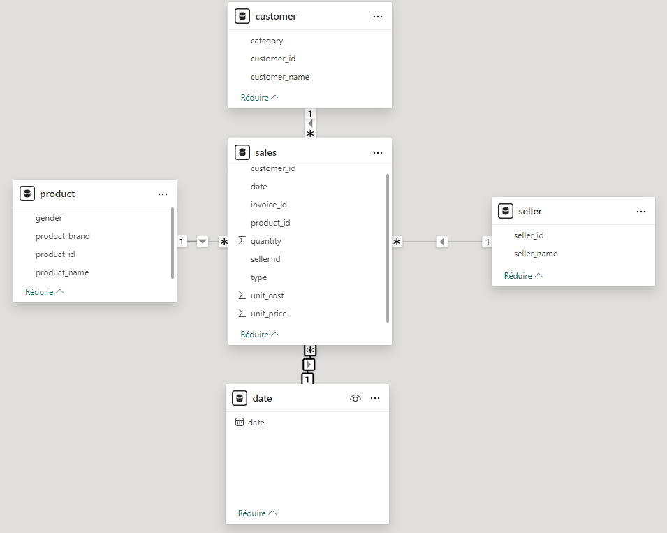
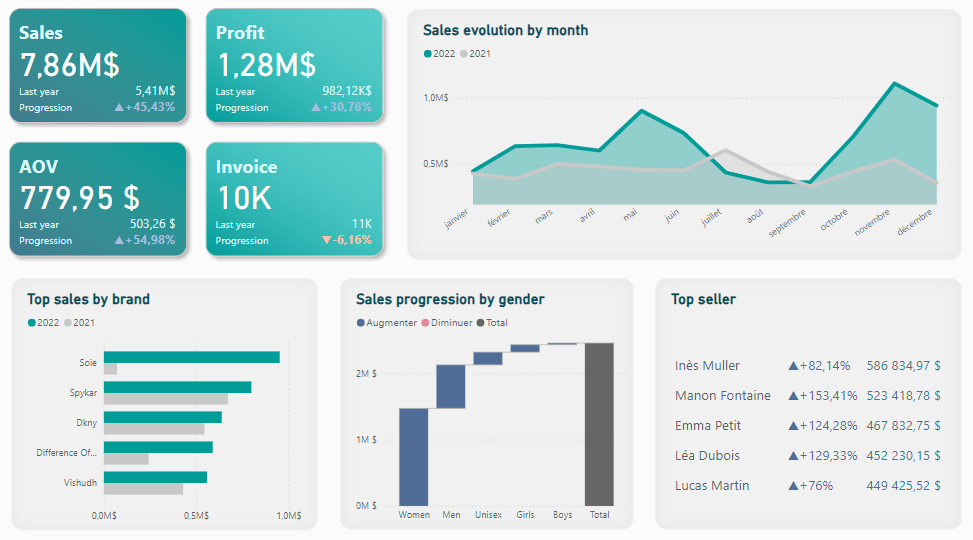

# 👕 Retail Clothing Dashboard

## 🚀 Overview

This project showcases a **Power BI dashboard** designed for a clothing retail company. The company sells apparel from various brands and employs 20 salespeople. The dashboard provides key insights into the business performance, leveraging cleaned and structured data.  

---

## 🧰 Technologies Used
- **⚙️ Power BI Desktop**
- **🛠 Power Query** for data cleaning and data transformation
- **🧮 DAX** for creating measures

---

## 🛠 Data Preparation
- **🧹 Data Cleaning**: Conducted in Power Query to ensure accurate and meaningful insights.
- **📐 Semantic Model**: Built to establish relationships between datasets and measures.

---

## 📸 Dashboard Preview
### 📂 Semantic Model
The data structure follows a **Star Schema**, with sales as the fact table and dimension tables to organize the data efficiently for analysis.

### 📊 Dashboard Overview

---

## ✨ Features

### 📊 KPIs Included:
- **💰 Sales**: Total revenue generated.
- **📈 Profit**: Total earnings after costs.
- **🛒 AOV (Average Order Value)**: Average amount of money spent by customers per order.
- **🧾 Invoice**: Total count of invoices generated.

### 📌 Visualizations:
1. **📆 Sales Evolution by Month**: Displays monthly sales trends versus last year.
2. **🏆 Top 5 sales Brands**: Highlights the five best-performing brands.
3. **🚻 Sales Progression by Gender**: Analyzes sales distribution across genders.
4. **⭐ Top 5 Sellers**: Shows the top-performing salespeople.

